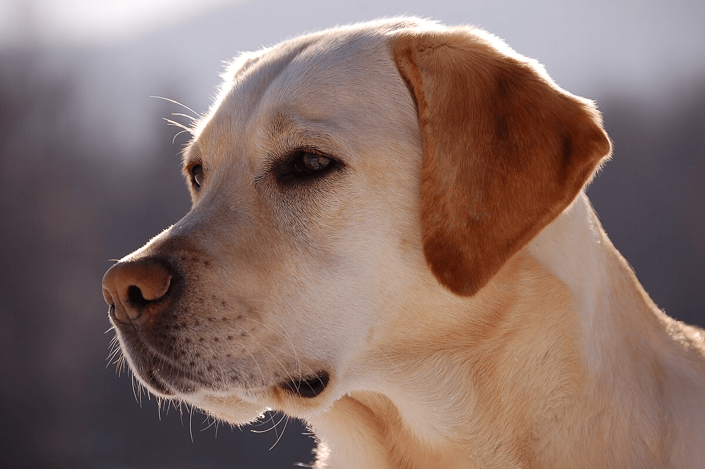

# Підпис зображень RSA за допомогою стеганографії LSB

## Огляд
Цей проект дозволяє цифрово підписати зображення за допомогою RSA та приховати підпис у файлі зображення за допомогою стеганографії з використанням найменш значущого біту (LSB). Такий підхід дозволяє приховати підпис у зображенні, не змінюючи його цілісність.

## Потенційні застосування
- Безпечний розподіл зображень.
- Водяні знаки або сертифікація цифрового мистецтва.
- Цифрова криміналістика та виявлення підробок.

## Структура проекту
```
rsa-image-signing/
├── data/
│   └── signature.bin
├── images/
│   ├── original_labrador.png
│   └── encrypted_labrador.png
├── keys/
│   ├── private_key.pem
│   └── public_key.pem
├── src/
│   ├── key_generator.py
│   ├── signature.py
│   ├── encryptor.py
│   ├── signature_checker.py
│   └── main.py
├── .gitignore
└── requirements.txt
```

## Налаштування
1. **Клонувати репозиторій**  
   ```bash
   git clone https://github.com/sharaievPn/rsa-image-signing.git
   cd rsa-image-signing
   ```

2. **Створити віртуальне середовище**  
   ```bash
   python3 -m venv .venv
   source .venv/bin/activate
   ```

3. **Встановити залежності**  
   ```bash
   pip install -r requirements.txt
   ```

## Використання
1. **Генерація RSA ключів**  
   ```bash
   python src/key_generator.py
   ```
   Це створить `keys/private_key.pem` та `keys/public_key.pem`.

2. **Підписати зображення та вбудувати підпис**  
   ```bash
   python src/main.py
   ```
   За замовчуванням `main.py` підписує `images/original_labrador.png`, зберігає підпис у `data/signature.bin`, вбудовує його в `images/encrypted_labrador.png` та перевіряє підпис.

3. **Перевірити підписане зображення**  
   ```bash
   python src/signature_checker.py --image images/encrypted_labrador.png --public-key keys/public_key.pem
   ```
   (Або використати `main.py`, який автоматично виконує перевірку.)

## Приклад з використанням публічних зображень
Оригінальне зображення мало вигляд:


Після створення підпису, це зображення було підписане та збережене. Можна звернути увагу, що якісні зміни зображення є абсолютно невидимі людському оку.


## Деталі реалізації
- **Стеганографія LSB**:  
  Модуль `encryptor.py` перетворює кожен байт RSA підпису на 8-бітний двійковий рядок і вбудовує кожен біт у найменш значущий біт червоного каналу кожного пікселя зображення.
- **Цифровий підпис**:  
  - Обчислюється SHA-256 хеш даних зображення.  
  - Підпис генерується з використанням RSA-PSS.

## Примітки
- Приклад зображення — PNG; підхід працює з будь-якими форматами, підтримуваними бібліотекою Pillow (наприклад, JPEG, BMP).
- Переконайтеся, що у зображенні достатньо пікселів для вбудовування підпису (`довжина підпису * 8 <= ширина * висота`).
